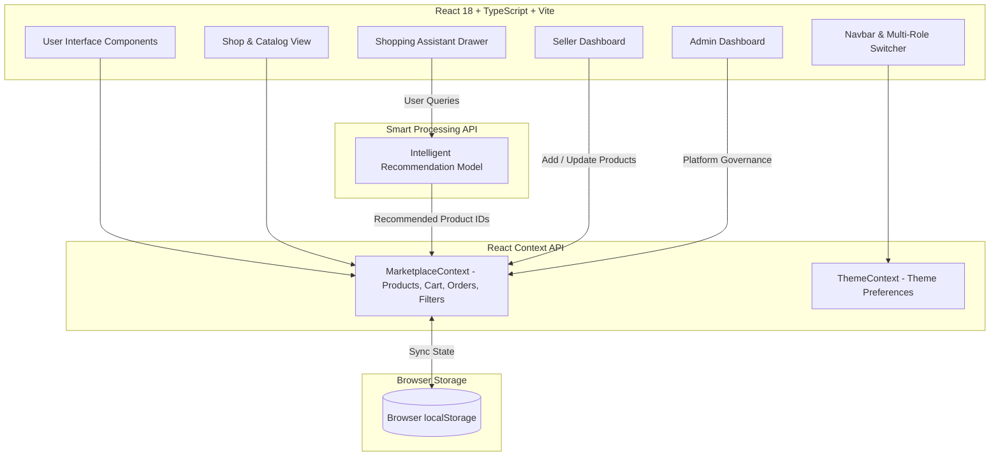

# 🛒 OmniMart — Next-Gen Smart E-Commerce Marketplace

OmniMart is a modern, high-performance, multi-vendor e-commerce platform designed with an integrated **Smart Shopping Concierge**, dynamic multi-role experiences (**Buyer, Seller, Admin**), real-time product filtering, interactive cart management, order tracking, and an immersive ambient soundscape player.

---
## 🌟 Key Features

### 🛍️ Buyer Experience
- **Smart Catalog & Multi-Category Search**: Filter by categories (Electronics, Computers, Mobile Phones, Fashion, Footwear, Beauty, Sports & Fitness), price range, brands, ratings, and instant text search.
- **Smart Shopping Assistant**: Chat with an intelligent concierge that recommends products based on natural language preferences, budget constraints, and feature needs.
- **Interactive Cart & Checkout**: Seamless add-to-cart, quantity adjustments, discount promo codes, and step-by-step mock checkout with confetti celebration.
- **Live Order Tracking**: Visual timeline tracking orders from "Order Placed" -> "Processing" -> "Shipped" -> "Out for Delivery" -> "Delivered".
- **Ambient Shopping Soundscape**: Built-in ambient music player for a focused, relaxing browsing atmosphere.

### 🏢 Seller Portal
- **Inventory & Stock Management**: Add, update, and manage products with SKU, categories, pricing, discounts, and high-resolution media galleries.
- **Sales Analytics**: Monitor real-time seller revenue, units sold, top-performing items, and low-stock alerts.

### 🛡️ Admin Governance Dashboard
- **Platform Health & Metrics**: Overview of total gross merchandise value (GMV), active buyers, seller counts, and transaction logs.
- **Product & Merchant Moderation**: Review catalog items, approve/verify sellers, and adjust marketplace settings.

---

## 🛠️ Tech Stack

| Domain | Technology |
| :--- | :--- |
| **Frontend Framework** | React 18, TypeScript |
| **Build Tooling** | Vite |
| **Styling & Motion** | Tailwind CSS v4, Motion (`motion/react`) |
| **Icons** | Lucide React |
| **Smart Processing** | Natural Language Processing & Recommendation Engine |
| **State & Storage** | React Context API, Browser `localStorage` |

---

## 📐 Architecture Diagram



---

## 📸 Screenshots & Highlights

| Storefront Catalog | Smart Shopping Assistant |
| :---: | :---: |
|  |  |

| Seller Dashboard | Admin Panel |
| :---: | :---: |
|  |  |

---

## 🚀 Installation & Setup Instructions

### Prerequisites
- **Node.js**: Version `18.x` or higher
- **npm**: Version `9.x` or higher

### Steps

1. **Clone the repository**
   ```bash
   git clone https://github.com/heshmasree2809/omnimarket-enterprise-ai-multi-vendor-marketplace.git
   cd omnimarket-enterprise-ai-multi-vendor-marketplace
   ```

2. **Install dependencies**
   ```bash
   npm install
   ```

3. **Configure Environment Variables**
   Create a `.env` file in the project root directory (refer to `.env.example`):
   ```env
   GEMINI_API_KEY=your_api_key_here
   ```

4. **Start the Development Server**
   ```bash
   npm run dev
   ```
   The application will run locally at `http://localhost:3000`.

5. **Build for Production**
   ```bash
   npm run build
   ```

---

## ☁️ Deployment to Render (Step-by-Step Guide)

Follow these steps to deploy **OmniMart** live on [Render](https://render.com):

### Option A: 1-Click Blueprint Deployment (Recommended)

1. Push this repository to GitHub (`heshmasree2809/omnimarket-enterprise-ai-multi-vendor-marketplace`).
2. Log in to [Render Dashboard](https://dashboard.render.com).
3. Click **New +** in the top right corner and select **Blueprint**.
4. Connect your GitHub account and select the repository: `heshmasree2809/omnimarket-enterprise-ai-multi-vendor-marketplace`.
5. Render will automatically detect `render.yaml` with preconfigured settings:
   - **Service Name**: `omnimarket-marketplace`
   - **Environment**: `Node`
   - **Build Command**: `npm run build`
   - **Start Command**: `npm run start`
6. Enter your `GEMINI_API_KEY` under the secret environment variables prompt.
7. Click **Apply**. Render will automatically build and deploy your application.

---

### Option B: Manual Web Service Setup

1. Log in to your [Render Dashboard](https://dashboard.render.com).
2. Click **New +** -> **Web Service**.
3. Choose **Build and deploy from a Git repository** and connect your GitHub repo `heshmasree2809/omnimarket-enterprise-ai-multi-vendor-marketplace`.
4. Configure the Web Service settings as follows:
   - **Name**: `omnimarket-marketplace`
   - **Region**: Choose the closest location (e.g. Singapore, Oregon, Frankfurt)
   - **Branch**: `main` (or `master`)
   - **Root Directory**: *(Leave blank)*
   - **Runtime**: `Node`
   - **Build Command**: `npm run build`
   - **Start Command**: `npm run start`
   - **Instance Type**: `Free` (or higher)
5. Scroll down to **Environment Variables** and add:
   - **Key**: `NODE_ENV` | **Value**: `production`
   - **Key**: `GEMINI_API_KEY` | **Value**: *(Your API Key)*
6. Click **Create Web Service**.
7. Render will build the Vite assets, bundle the Express server (`dist/server.cjs`), and launch the application. Once complete, your live deployment link will be active!

---

## 📁 Folder Structure

```
├── public/                  # Static public assets
├── src/
│   ├── components/          # Reusable UI components
│   │   ├── AmbientMusicPlayer.tsx
│   │   ├── Footer.tsx
│   │   ├── Navbar.tsx
│   │   ├── ProductCard.tsx
│   │   └── RoleSwitcherBar.tsx
│   ├── context/             # React Context Providers
│   │   ├── MarketplaceContext.tsx
│   │   └── ThemeContext.tsx
│   ├── data/                # Pre-populated mock dataset & catalog
│   │   └── mockData.ts
│   ├── pages/               # Main Application Views
│   │   ├── AdminDashboardPage.tsx
│   │   ├── CartPage.tsx
│   │   ├── HomePage.tsx
│   │   ├── ProductDetailPage.tsx
│   │   ├── ProfilePage.tsx
│   │   ├── SellerDashboardPage.tsx
│   │   └── ShopPage.tsx
│   ├── services/            # Shopping Assistant & Recommendation Services
│   │   └── geminiService.ts
│   ├── types/               # TypeScript Interfaces & Definitions
│   │   └── marketplace.ts
│   ├── App.tsx              # Root Routing & View Switcher
│   ├── index.css            # Global Tailwind CSS Styles
│   └── main.tsx             # Entry Point
├── metadata.json            # Application Metadata
├── package.json             # Project Dependencies & Scripts
├── tsconfig.json            # TypeScript Configuration
└── vite.config.ts           # Vite Build Configuration
```

---

## 🔮 Future Enhancements

- [ ] **Payment Gateway Integration**: Stripe & PayPal checkout integration.
- [ ] **Real-Time WebSockets**: Live order status push updates and seller notifications.
- [ ] **Cloud Persistence**: Database synchronization replacing local storage.
- [ ] **Multi-Language (i18n)**: Internationalization support for global shoppers.
- [ ] **AR Product Preview**: 3D & Augmented Reality product view for footwear & furniture.

---

## 📄 License

This project is open-source under the [MIT License](LICENSE).
